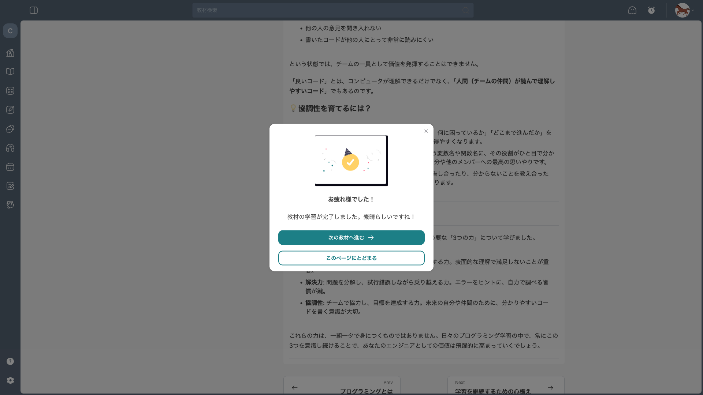

# 教材の操作マニュアル

## 1. 教材一覧を見る

### 1-1. 教材一覧ページを開く

1. サイドバーの「教材」をクリックすると、教材一覧ページが表示されます。

<!-- 📸 撮影指示: サイドバーの「教材」が選択された状態で、教材一覧ページ全体が表示されている画面。旧教材のカード一覧が見える状態 -->

### 1-2. 新教材セクションを確認する

1. ページを下にスクロールすると、区切り線の下に「新教材」セクションが表示されます。tutorial-1 から tutorial-13 まで、カード形式で並んでいます。

<!-- 📸 撮影指示: 教材一覧ページを下にスクロールし、「新教材」ラベルと新教材カード一覧が表示されている状態 -->

## 2. 教材を読む

### 2-1. 教材を開く

1. 学習したい教材のカードをクリックすると、教材の詳細ページに移動します。最初の Chapter の最初のセクションが自動的に表示されます。

<!-- 📸 撮影指示: tutorial-1 の教材詳細ページ。左カラムに Chapter 一覧と進捗率、右カラムに教材本文が表示されている状態 -->

### 2-2. 教材ページの構成

教材詳細ページは、以下の 2 つのエリアで構成されています。

| エリア | 内容 |
|--------|------|
| 左カラム（目次） | 進捗率（%）、Chapter 名、セクション一覧 |
| 右カラム（本文） | セクションのタイトル、学習目標、本文、まとめ |

### 2-3. セクションを切り替える

1. 左カラムのセクション名をクリックすると、そのセクションの内容が右カラムに表示されます。

<!-- 📸 撮影指示: 左カラムで別のセクション（例: 「エンジニアに必要な3つの力」）をクリックした後の画面。選択中のセクションがハイライトされている状態 -->

## 3. 教材を読了する

### 3-1. 読了ボタンをクリックする

1. 教材本文を最後まで読んだら、ページ下部の「この記事を読了する🔥」ボタンをクリックします。

<!-- 📸 撮影指示: 教材本文の最下部にある「この記事を読了する🔥」ボタンが表示されている状態。ボタン周辺が見える程度にスクロールした画面 -->

### 3-2. 読了完了モーダルの操作

1. 読了ボタンをクリックすると、「お疲れ様でした！」というモーダルが表示されます。

<!-- 📸 撮影指示: 読了完了モーダルが表示されている状態。「次の教材へ進む」「このページにとどまる」ボタンが見える -->

モーダルには以下のボタンがあります。

| ボタン | 動作 |
|--------|------|
| 「次の教材へ進む」 | 次のセクションに移動します |
| 「このページにとどまる」 | モーダルを閉じて、現在のページに留まります |

### 3-3. 進捗率の確認

1. セクションを読了すると、左カラムの進捗率が更新され、読了したセクションにチェックアイコンが付きます。

<!-- 📸 撮影指示: 読了後の左カラム。進捗率が 17% に更新され、読了済みセクションにチェックアイコンが付いている状態。要素切り抜きで左カラム部分のみ -->
